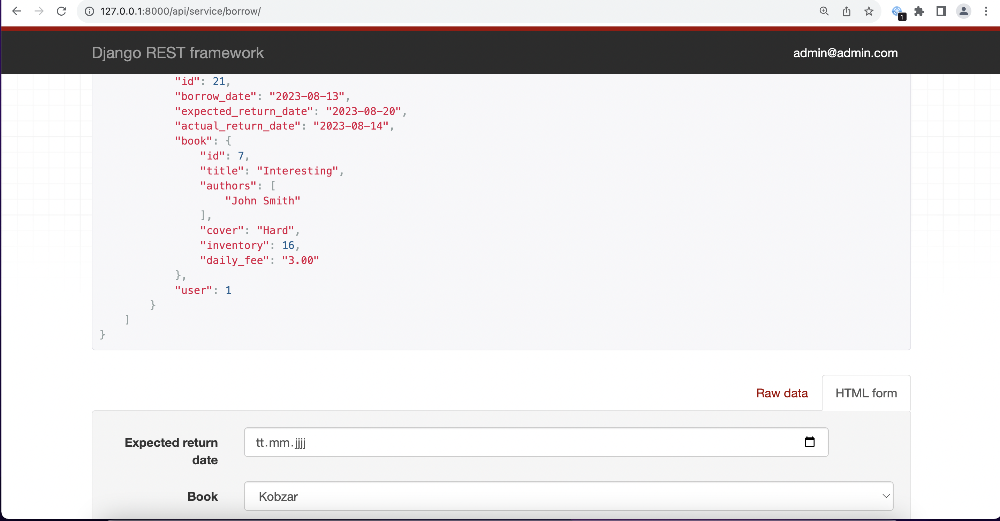

# library-service
## An online management system for book borrowings
Library Service allows you to tracks books borrowed by users

## Installing / Getting started
```shell
git clone https://github.com/andriy-md/library-service.git
cd library_service
python3 -m venv venv
source venv/bin/activate
pip install -r requirements.txt
python manage.py runserver      # Starts Django Server
```

## Features
* Allows users to register in system
* Admin may create new Author, and Book. User may see list of books and filter them by title
* Authorized User may borrow a Book
* Admin may return a Book

## Demo



